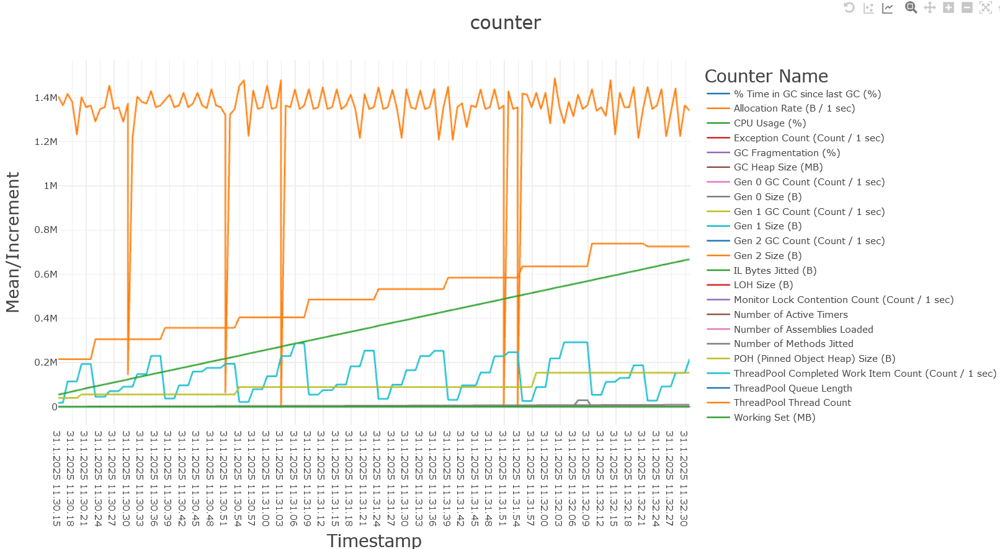

Refs:
    * [Work flow of diagnosing memory performance issues – Part 0](https://devblogs.microsoft.com/dotnet/work-flow-of-diagnosing-memory-performance-issues-part-0/)
    * [Work flow of diagnosing memory performance issues – Part 1](https://devblogs.microsoft.com/dotnet/work-flow-of-diagnosing-memory-performance-issues-part-1/)
    * [Work flow of diagnosing memory performance issues – Part 2](https://devblogs.microsoft.com/dotnet/work-flow-of-diagnosing-memory-performance-issues-part-2/)
    * [Troubleshooting high memory usage with ASP.NET Core on Kubernetes](https://blog.markvincze.com/troubleshooting-high-memory-usage-with-asp-net-core-on-kubernetes/)
    * [Running with Server GC in a Small Container Scenario Part 0](https://devblogs.microsoft.com/dotnet/running-with-server-gc-in-a-small-container-scenario-part-0/)
    * [Running with Server GC in a Small Container Scenario Part 1 – Hard Limit for the GC Heap](https://devblogs.microsoft.com/dotnet/running-with-server-gc-in-a-small-container-scenario-part-1-hard-limit-for-the-gc-heap/)
    * [GC Perf Infrastructure – Part 1](https://devblogs.microsoft.com/dotnet/gc-perf-infrastructure-part-1/)
    * [.NET Platform Architecture](https://github.com/sidristij/dotnetbook)
    * [Fighting Common WPF Memory Leaks with dotMemory](https://blog.jetbrains.com/dotnet/2014/09/04/fighting-common-wpf-memory-leaks-with-dotmemory/)
    * [Reproducing a WPF memory leak](https://ayende.com/blog/4296/reproducing-a-wpf-memory-leak)
    * [Debug a memory leak in .NET Core](https://docs.microsoft.com/en-us/dotnet/core/diagnostics/debug-memory-leak)
    * [Avoiding Memory Leaks in Visual Studio Editor Extensions](https://devblogs.microsoft.com/visualstudio/avoiding-memory-leaks-in-visual-studio-editor-extensions/)
    * [8 Ways You can Cause Memory Leaks in .NET](https://michaelscodingspot.com/ways-to-cause-memory-leaks-in-dotnet/)

# Task1
Ran `dotnet run -c Release` and `dotnet-counters collect --name HomeworkLeak --format csv` against HomeworkLeak project. The result of the command is stored in [counter.csv](./counter.csv) file. (Tips: when you upload csv file to https://csvplot.com/, remove the last empty line)

Q&A:
* What's growing?
We can see that IL Bytes Jitted (B) is linearly growing over the whole timeline. There is also a very slow grow in Gen 1 GC Count (Count/sec), and it is observable how Gen 1 Size (B) is used, it constantly reaches its threshold and is cleaned up. On the contrary, the Gen 2 Size is resistently growing from 0.2M to close to 0.8M, and the Gen 2 GC Count is not encountered.
* Do GCs are happening?
GCs are happening for Gen 1 (low rate) and no GC for Gen 0 and Gen 2.
* Do we have fragmentation? In other words - is this "no GC", "fragmentation" or a "real"
memory leak problem? 
This seems "no GC". I see that Gen 2 is growing in size aggressively but there is no GC at all for that genearation. Hence, I may conclude that there is no GC type of memory leaks.  

Record around few minutes gc-collect session with dotnet-trace. 
* What are the reasons for the GCs?
Ran `dotnet-trace collect -p 4612 --profile gc-collect` in order to obtain `.nettrace` file. By annlyzing [nettrace file](./HomeworkLeak.exe_20250203_115222.nettrace), I can see that all GCs are triggered by `AllocSmall` which means that GCs happens in response to allocation of ordinary object. Gen0 GC happens very often and its survival rate is 0-2%, which is insignificant. However, less frequent Gen1 GCs show survival rates between 22 and 40%, which is a bit higher. Furthermore, Gen2 GCs show drastic difference, the survival rate is between 89-95%, which means that most of the objects are still kept in a heap, you may also notice that there is one Pinned Object in Gen2 GC events, maybe that is the reason keeping high rate of survivals. Also GenX Frag % is 0% across all GCs.  

Record around a few minuts gc-dump session with dotnet-gcdump.
* What's the reason of the memory growth?
Ran `dotnet-gcdump collect -p 18345` in order to obtain .gcdump file. 
Analyzing dump, I see that most of the allocated objects are placed in static hashtable (which is already weird), secondly there are a lot of RegEx parsings (maybe it caches the regex patterns) that also may explain allocations for RuntimeTypes (I also saw some IL related memory management). I may suspect that CLR caches all regex expressions in a special hashtable for reuse, but it never happens and it keeps accumulating. And there is also a a normal string allocation, which takes a significant portion of allocations as well. But I am not sure IL and Regex ;). 